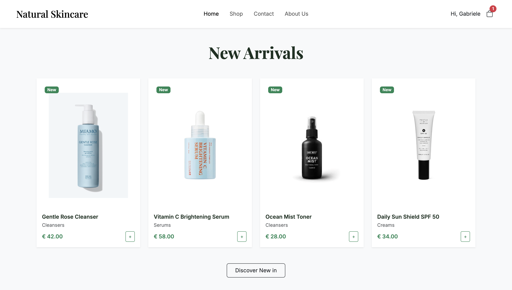
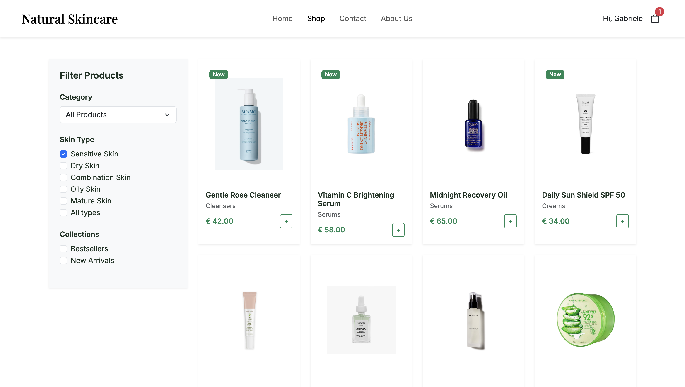
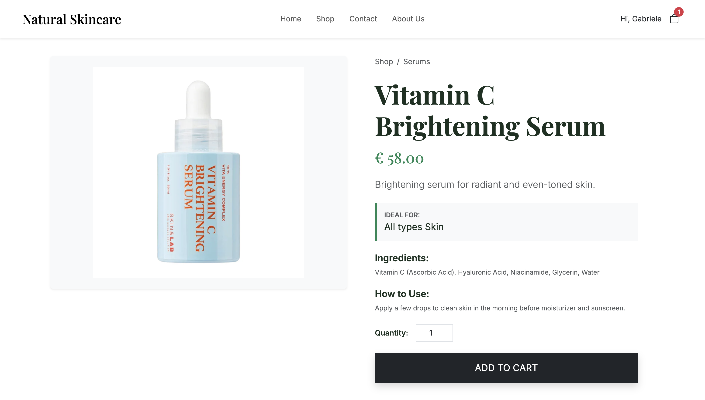
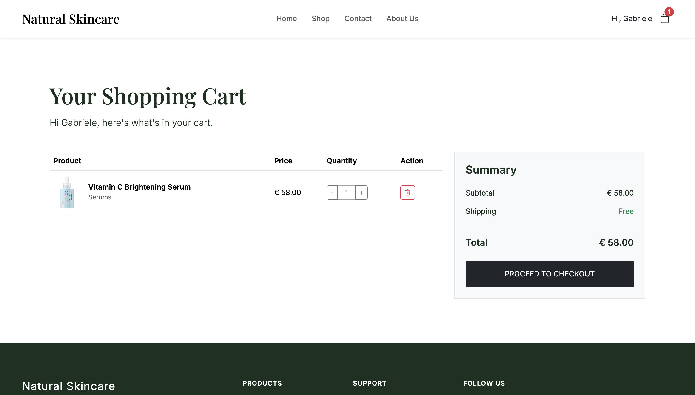
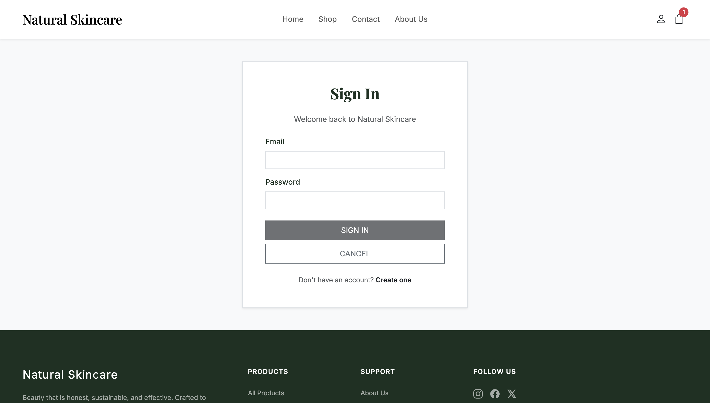
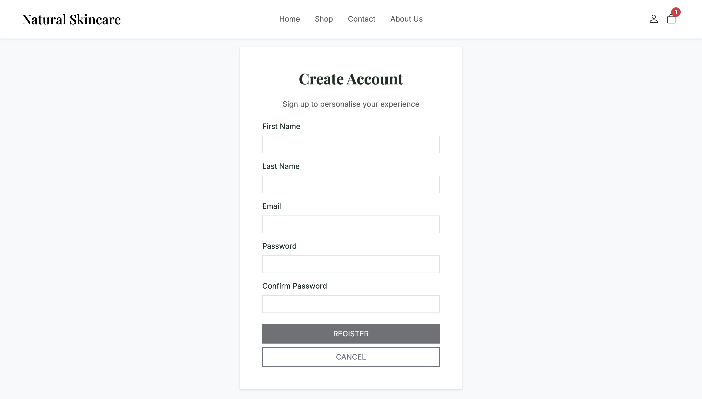

# Natural Skincare - Web Shopping System
### Frameworks and Architectures for the Web
IT University of Copenhagen — May 2026

---

**Group 6**

| Member |
|--------|
| Gabriele Matteoli |
| Giulia Migliorini |
| Luca Bailo |
| Sergio Brancato |
| Zhuowa Wang |

---

## Table of Contents

1. [Web Design of the Client-Side Application](#1-web-design-of-the-client-side-application)
   - 1.1 [Information Architecture](#11-information-architecture)
   - 1.2 [Navigation Concepts](#12-navigation-concepts)
   - 1.3 [Visual Design Principles](#13-visual-design-principles)
   - 1.4 [Page-by-Page Layout Overview](#14-page-by-page-layout-overview)
2. [Design of the RESTful API](#2-design-of-the-restful-api)
   - 2.1 [List of Resources](#21-list-of-resources)
   - 2.2 [Endpoint Descriptions](#22-endpoint-descriptions)
3. [Software Architecture](#3-software-architecture)
   - 3.1 [Physical Architecture](#31-physical-architecture)
   - 3.2 [Logical Architecture](#32-logical-architecture)
   - 3.3 [Software Styles, Patterns, and Techniques](#33-software-styles-patterns-and-techniques)
- [Appendix - Detailed RESTful API Specification](#appendix--detailed-restful-api-specification)

---

## 1. Web Design of the Client-Side Application

### 1.1 Information Architecture

The Natural Skincare application organises its content through three independent taxonomies that users can combine to locate products precisely.

#### Taxonomies

The **product category** taxonomy classifies items by functional role: Cleansers, Serums, Creams, Masks, Oils, Toners, and SPF. This is the primary navigation axis, exposed as a dropdown selector in the Shop sidebar.

The **skin type** taxonomy classifies products by consumer need: Sensitive Skin, Dry Skin, Combination Skin, Oily Skin, Mature Skin, and All Types. It is exposed as a multi-select checkbox group and can be combined with the category filter simultaneously.

The **collection** taxonomy captures editorial curation: Bestsellers and New Arrivals. These labels appear both as filter checkboxes in the Shop sidebar and as dedicated product sections on the Home page, providing two entry points for the same content.

#### Content Hierarchy

The information hierarchy follows three levels of progressively narrowing scope, plus auxiliary content areas:

| Level | Page | Content scope |
|-------|------|---------------|
| 1 | Home `/` | Curated overview: New Arrivals, Bestsellers, Featured Products. Hero section with CTA. Personalised greeting for registered users. |
| 2 | Shop `/shop` | Full catalogue with three independent filter axes: category, skin type, collection. |
| 3 | Product Detail `/product/:id` | Complete product info: name, price, description, skin type, ingredients, usage instructions, quantity selector, add-to-cart action. |
| - | Cart `/cart` | Basket management: quantity +/- controls, per-item removal, order summary panel, simulated checkout. |
| - | Register `/register` | Optional user registration with real-time form validation. |
| - | Static pages | About Us, Contact with form, Shipping, Returns. |

---

### 1.2 Navigation Concepts

Four navigation layers operate simultaneously to ensure users can always locate themselves within the site and move efficiently between sections.

**Primary navigation.** A sticky top navigation bar provides direct access to Home, Shop, Contact, and About Us from every page. The active link is highlighted using React Router's `NavLink` component, which applies an active CSS class automatically. On small screens the bar collapses into a hamburger menu.

**Utility navigation.** The right section of the navbar contains a user icon (linking to `/login` when anonymous, or displaying "Hi, {firstName}" with a logout action when registered) and a cart icon with a live red badge showing the total item count. The badge updates immediately after every add/remove operation.

**Contextual navigation.** The Product Detail page displays a breadcrumb trail (Shop / Category) allowing users to return to the filtered product list. All product cards in Home and Shop are fully clickable and navigate directly to the detail page via React Router's `<Link>` component.

**Footer navigation.** A dark-green footer on every page replicates the key links (All Products, About Us, Contact) and adds secondary content (social links, brand statement). It is rendered once inside the shared Layout component.

**Pre-filtered deep links.** The "New Arrivals" and "Bestsellers" sections on the Home page include links that navigate to `/shop` with the collection filter pre-applied via URL query parameter (`?filter=new` or `?filter=bestsellers`). The Shop page reads this parameter with `useSearchParams` on mount.

*Navbar - primary and utility navigation*

*Footer - secondary navigation and brand statement*

---

### 1.3 Visual Design Principles

The visual language reflects the brand identity of a premium natural skincare line: clean, restrained, and trustworthy.

**Colour palette.** The primary colour is a dark forest green (`#1C3B31`), used for the navigation bar, footer, headings, and primary call-to-action buttons. Product prices and interactive highlights use a mid green (`#2D6A4F`). Page backgrounds are white or near-white, keeping visual focus on product photography and improving readability.

**Typography.** The brand logo and all page headings use a serif typeface (system-serif / Times New Roman), conveying a sense of authority and heritage. Body copy, labels, and form controls use the Bootstrap default sans-serif stack for legibility at smaller sizes.

**Component consistency.** The `ProductCard` component is shared by the Home and Shop pages. It displays the product image, name, category label, price, and a "New" badge (green pill) when applicable, ensuring a uniform grid appearance regardless of context.

**Responsive layout.** Bootstrap 5 provides the responsive grid. The product grid adapts from four columns on desktop to two on tablet and one on mobile. The navbar collapses to a hamburger menu on narrow viewports. The Cart two-column layout (table + summary panel) stacks vertically on small screens.

---

### 1.4 Page-by-Page Layout Overview

#### Home Page

The home page opens with a full-width hero section featuring a botanical photography background, the brand title in large serif text, a tagline ("Pure formulas, clinically proven results for your skin."), and a "Discover the Collection" CTA button with an outlined style. Immediately below the hero, three value propositions (Natural Ingredients, Clinically Tested, Eco-Sustainable) are displayed as icon-text pairs. Three product sections follow (New Arrivals, Bestsellers, and Featured Products), each presenting a row of ProductCards. If the user is registered, a personalised greeting appears in the hero overlay.

<!-- INSERT SCREENSHOT: home page -->

*Figure 1a - Home page layout (hero section)*

*Figure 1b - Home page layout (product sections)*

---

#### Shop Page

The shop page is divided into a fixed left sidebar and a responsive product grid. The sidebar contains a Category dropdown (All Products + seven categories), Skin Type checkboxes (six options), and Collections checkboxes (Bestsellers, New Arrivals). Any filter change triggers an immediate API re-fetch without a full page reload. The grid displays products in four columns on desktop, with "New" badges on new arrivals.

<!-- INSERT SCREENSHOT: shop page -->

*Figure 2 - Shop page layout*

---

#### Product Detail Page

The product detail page uses a two-column layout. The left column displays a large product image in a light-grey panel. The right column contains: a breadcrumb trail (Shop / Category), the product name in large serif text, the price in green, a short description, an "Ideal For" skin type callout, an ingredients list, usage instructions, a quantity input, and the "ADD TO CART" button (full-width, dark green).

<!-- INSERT SCREENSHOT: product detail page -->

*Figure 3 - Product Detail page layout*

---

#### Cart Page

The cart page displays "Your Shopping Cart" as the page heading, followed by a product table and a sticky summary panel. Each row in the table shows the product thumbnail, name, category label, unit price, a quantity control (- / number / + buttons), and a trash-icon delete button. The summary panel on the right shows the subtotal, "Free" shipping label, total, and the "PROCEED TO CHECKOUT" button. Checkout is simulated: the cart empties and an alert confirms the order.

<!-- INSERT SCREENSHOT: cart page -->

*Figure 4 - Cart page layout*

---

#### Login and Registration Page

A centred registration form collects first name, last name, email, password, and password confirmation. Each field displays an inline red error message (Bootstrap's `invalid-feedback` class) if it fails validation: names require at least two characters, the email must be a valid address, the password must be at least eight characters, and the confirmation must match the password. The REGISTER button is disabled until all fields pass validation. A Cancel button redirects to the home page without saving. Users can also continue shopping without registering at any time.

The login page allows returning users to sign in with their email and password. Both pages are accessible from the user icon in the navbar.

*Figure 5 - Login page layout*

*Figure 6 - Registration page layout*

---

## 2. Design of the RESTful API

The server-side RESTful API is implemented in JavaScript using Node.js and Express. It exposes nine endpoints across three resource groups (products, categories, and the shopping cart) and serves as the sole data source for the React client. All request and response bodies use JSON. Product data is stored in `server/data/data.json` (a `products` array). Cart state is stored separately in `server/data/carts.json` (an object keyed by user identifier); this file is gitignored and created automatically on first use, so each developer's cart is local to their machine.

### 2.1 List of Resources

| Resource Path | POST | GET | PUT | DELETE |
|---------------|------|-----|-----|--------|
| `/products` | | Get all products (with optional filters) | | |
| `/products/:id` | | Get product by ID | | |
| `/categories` | | Get all categories | | |
| `/categories/:category/products` | | Get products in category | | |
| `/cart/:user` | Create cart | Get cart | | |
| `/cart/:user/:productId` | Add item (+1) | | | Remove item (-1) |
| `/cart/:user/:productId/all` | | | | Remove all units |

---

### 2.2 Endpoint Descriptions

#### `GET /products`
Returns a JSON array of all products in the catalogue. Accepts two optional query parameters: `?skin=` to filter by skin type and `?collection=` to filter by collection label (bestsellers or new). Both filters can be combined.

#### `GET /products/:id`
Returns the complete JSON object for the product identified by the integer `:id`, including all fields (name, price, category, skin type, image, ingredients, how-to-use, etc.). Returns HTTP 404 if the product does not exist.

#### `GET /categories`
Returns a JSON array of distinct category name strings derived from the product catalogue (e.g. `["Cleansers", "Serums", "Creams", "Masks", "Oils", "Toners", "SPF"]`).

#### `GET /categories/:category/products`
Returns products belonging to the specified category. Accepts the same optional `?skin=` and `?collection=` filters as `GET /products`, allowing fine-grained filtering within a category.

#### `POST /cart/:user`
Creates an empty shopping basket for the given user identifier if one does not already exist. The client always uses the fixed identifier `"guest"` since no real authentication is required.

#### `GET /cart/:user`
Returns the current basket contents as a JSON array of `{ productId, quantity }` objects. Returns an empty array if the cart has not been created yet.

#### `POST /cart/:user/:productId`
Adds one unit of the specified product to the basket. If the item is already present its quantity is incremented by one. The client calls this endpoint N times inside a loop when the user selects quantity > 1 on the Product Detail page.

#### `DELETE /cart/:user/:productId`
Removes one unit of the specified product from the basket. If the quantity reaches zero the item is removed from the cart entirely.

#### `DELETE /cart/:user/:productId/all`
Removes all units of the specified product from the basket in a single operation. This endpoint is triggered by the trash-icon button in the Cart page row.

> **Note**: the endpoint specification (including request/response body examples, HTTP status codes, and sample calls) is provided in the Appendix.

---

## 3. Software Architecture

### 3.1 Physical Architecture

The system follows a two-tier client/server web architecture. The two components run as separate processes on the developer's machine and communicate exclusively over HTTP. The project is structured as a monorepo: a root `package.json` uses the concurrently package to start both processes with a single `npm run dev` command.

| Component | Technology | Port (dev) | Role |
|-----------|-----------|------------|------|
| Client | React 18 + TypeScript, Vite | 5173 | Single-Page Application. Handles all UI rendering, routing, and user interaction. Communicates with the server via HTTP `fetch()` calls. |
| Server | Node.js + Express (JavaScript) | 3000 | RESTful API. Serves product catalogue data from `data.json` and manages cart state in `carts.json`. Stateless across requests (except for file-persisted cart data). |

During development, Vite's built-in reverse proxy transparently forwards all requests to `/products`, `/categories`, and `/cart` to `http://localhost:3000` (configured in `client/vite.config.ts`). This eliminates CORS issues without requiring any change to the Express server.

---

### 3.2 Logical Architecture

#### Client: five-layer structure

The React application is divided into five horizontal layers with clear separation of concerns:

| Layer | Key files | Responsibility |
|-------|-----------|---------------|
| Types | `types/index.ts` | TypeScript interfaces shared across all layers: `Product`, `CartItem`, `Category`, `RegisteredUser`. |
| API / Service | `api/products.ts` `api/categories.ts` `api/cart.ts` | Encapsulates all `fetch()` calls to the server. Returns typed Promises. No UI logic. |
| State / Context | `contexts/AuthContext.tsx` `contexts/CartContext.tsx` `utils/storage.ts` | Global React state: registered user (with localStorage persistence) and cart item count for the badge. |
| Components | `components/Layout.tsx` `components/Navbar.tsx` `components/Footer.tsx` `components/ProductCard.tsx` | Reusable UI building blocks. Layout wraps every page with Navbar and Footer via React Router's `<Outlet>`. |
| Pages | `pages/Home.tsx` `pages/Shop.tsx` `pages/ProductDetail.tsx` `pages/Cart.tsx` `pages/Register.tsx` + 4 static pages | Route-level components. Each page manages its own local state with `useState` / `useEffect` and calls the API layer directly. |

#### Server: four-layer structure

| Layer | Key files | Responsibility |
|-------|-----------|---------------|
| Entry point | `app.js` | Creates the Express app, mounts the three routers, starts the HTTP listener. |
| Router | `products/products.router.js` `categories/categories.router.js` `cart/cart.router.js` | Declares which HTTP method + path maps to which controller function. Contains no business logic. |
| Controller | `products/products.controller.js` `categories/categories.controller.js` `cart/cart.controller.js` | Contains all handler logic: reads/filters data, writes cart updates, builds JSON responses. |
| Data Access | `data/dataAccess.js` `data/data.json` `data/carts.json` | Shared `readData()`, `readCarts()`, `writeCarts()` functions. Single point of file I/O; no controller duplicates this logic. |

---

### 3.3 Software Styles, Patterns, and Techniques

#### Context API

Rather than threading the registered user and the cart item count down through every component via props, the application uses React's Context API. Two providers wrap the entire route tree in `App.tsx`:

- **AuthContext** holds the `RegisteredUser` object (or `null`) and exposes `register()` and `logout()`. On mount it reads `localStorage` via `getStoredUser()` to restore the previous session, so registration survives page reloads.
- **CartContext** holds `itemCount` (total basket quantity) and a `refresh()` function. Every page that modifies the cart calls `refresh()` after the operation, triggering a server re-fetch and updating the Navbar badge immediately.

Both contexts are accessed via custom hooks (`useAuth()`, `useCart()`) that wrap `useContext` and throw a descriptive error if called outside the provider.

#### Lifted State

The cart badge in the Navbar must reflect every add/remove operation regardless of which page triggers it. The item count is therefore lifted out of individual page components and stored in `CartContext`, where the Navbar can read it without any parent-child coupling.

#### React Router v6 and the Layout Pattern

React Router v6 manages client-side routing: the browser URL changes without full page reloads, which is the defining characteristic of a Single-Page Application. All nine routes are nested under a single `<Layout />` route that renders `<Navbar />`, then `<Outlet />` (the active page), then `<Footer />`. This ensures the navigation shell renders exactly once rather than being duplicated in every page.

#### React Hooks Overview

| Hook | Purpose | Used in |
|------|---------|---------|
| `useState` | Local component state (products list, filter values, cart rows, etc.) | Home, Shop, ProductDetail, Cart, Navbar, AuthContext, CartContext |
| `useEffect` | Fetch data on mount or when filter dependencies change; restore context state on mount | Home, Shop, ProductDetail, Cart, CartContext |
| `useContext` | Read global state (via `useAuth` / `useCart` wrappers) | Navbar, Home, Cart, ProductDetail, Register |
| `useCallback` | Memoises functions used as `useEffect` dependencies to prevent infinite re-render loops | Cart (`loadCart`), CartContext (`refresh`) |
| `useParams` | Reads the `:id` segment from the URL path | ProductDetail |
| `useSearchParams` | Reads `?filter=` from the URL query string to pre-select collection checkboxes | Shop |
| `useNavigate` | Programmatic navigation after form submit or Cancel click | Register |

#### Form Validation: Zod + React Hook Form

The registration form uses two complementary libraries bridged by `@hookform/resolvers/zod`. **Zod** defines the validation schema (minimum lengths for names, email format) and infers the TypeScript type automatically, so the type does not need to be declared separately. **React Hook Form** connects to DOM inputs directly rather than storing every keystroke in React state. The form is configured with `mode: 'onChange'`, so the Zod schema is evaluated on every keystroke and the REGISTER button activates as soon as all fields pass validation (`isValid === true`).

#### Bootstrap 5

Bootstrap 5 is imported as a production dependency and provides the responsive grid system (shop product grid, cart two-column layout), utility classes for spacing, colour, and typography, and the Navbar collapse component for the mobile hamburger menu. Custom CSS in `client/src/styles/app.css` overrides Bootstrap defaults to apply the brand colour palette and serif heading font.

#### Express Router / Controller Separation

The Express server applies the Router/Controller pattern. Each resource group (products, categories, cart) has a dedicated router file (route declarations only, no logic) and a controller file (all handler logic). The shared `data/dataAccess.js` module encapsulates `readData()`, `readCarts()`, and `writeCarts()`, ensuring no controller duplicates file I/O code.

#### Data Storage Solution

Server-side persistent data is split across two JSON files. `server/data/data.json` contains the `products` array (20 objects, each with id, name, price, category, skin type, image path, collection flags, ingredients, and usage instructions); this file is committed and identical across all machines. `server/data/carts.json` holds cart state as an object mapping user identifier strings to arrays of `{ productId, quantity }` items; this file is gitignored and created automatically on the first cart write, so each developer's cart is local to their own machine and never shared via git. Because no real authentication is required, the client always uses the fixed identifier `"guest"` as the cart key. Registered user data (first name, last name, email, and password) is stored exclusively in the browser's `localStorage` and is never sent to the server.

#### TypeScript

The entire React client is written in TypeScript. The `types/index.ts` file defines four shared interfaces (`Product`, `CartItem`, `Category`, `RegisteredUser`) used throughout the API layer, context providers, and page components. TypeScript's static analysis catches type mismatches at development time (before the code runs in the browser), significantly reducing the class of runtime errors. The Express server was kept in JavaScript.

---

## Appendix: Detailed RESTful API Specification

Detailed specification of all endpoints following the standard template provided in the project guidelines.

### List of Resources

| Resource Path | POST | GET | PUT | DELETE |
|---------------|------|-----|-----|--------|
| `/products` | | Get all products | | |
| `/products/:id` | | Get product by ID | | |
| `/categories` | | Get all categories | | |
| `/categories/:category/products` | | Get products in category | | |
| `/cart/:user` | Create cart | Get cart | | |
| `/cart/:user/:productId` | Add item (+1) | | | Remove item (-1) |
| `/cart/:user/:productId/all` | | | | Remove all units |

---

### Path: `/products`

**Method:** `GET`

**Summary:** Returns a list of all products in the catalogue, with optional filtering.

**URL Params:** `?skin={skinType}` (optional) · `?collection={label}` (optional, values: `bestsellers` / `new`)

**Body:** (none)

**Success Response:**
- Code: `200 OK`
- Body: `[ { id, name, price, category, skinType, image, isNew, isBestseller }, ... ]`

**Error Response:** -

**Sample Call:** `GET /products?skin=Dry+Skin&collection=bestsellers`

---

### Path: `/products/:id`

**Method:** `GET`

**Summary:** Returns the full details of a single product identified by its integer ID.

**URL Params:** `:id` - integer product identifier (required)

**Body:** (none)

**Success Response:**
- Code: `200 OK`
- Body: `{ id, name, price, category, skinType, image, isNew, isBestseller, ingredients, howToUse }`

**Error Response:**
- Code: `404 Not Found`
- Body: `{ "error": "Product not found" }`

**Sample Call:** `GET /products/10`

---

### Path: `/categories`

**Method:** `GET`

**Summary:** Returns the list of distinct product category names.

**URL Params:** (none)

**Body:** (none)

**Success Response:**
- Code: `200 OK`
- Body: `[ "Cleansers", "Serums", "Creams", "Masks", "Oils", "Toners", "SPF" ]`

**Error Response:** -

**Sample Call:** `GET /categories`

---

### Path: `/categories/:category/products`

**Method:** `GET`

**Summary:** Returns products belonging to the specified category, with optional further filtering.

**URL Params:** `:category` - category name string (e.g. `Serums`) · `?skin=` (optional) · `?collection=` (optional)

**Body:** (none)

**Success Response:**
- Code: `200 OK`
- Body: JSON array of product objects matching the category (and any filters). Returns `[]` if no match.

**Error Response:** -

**Sample Call:** `GET /categories/Serums/products?skin=Dry+Skin`

---

### Path: `/cart/:user` - POST

**Method:** `POST`

**Summary:** Creates an empty shopping basket for the given user identifier.

**URL Params:** `:user` - user identifier string (client uses `"guest"`)

**Body:** (none)

**Success Response:**
- Code: `200 OK`
- Body: `"Basket created for guest"` (plain text)

**Error Response:** -

**Sample Call:** `POST /cart/guest`

---

### Path: `/cart/:user` - GET

**Method:** `GET`

**Summary:** Returns the current contents of the shopping basket.

**URL Params:** `:user` . user identifier string

**Body:** (none)

**Success Response:**
- Code: `200 OK`
- Body: `[ { "productId": 10, "quantity": 2 }, ... ]` or `[]` if empty.

**Error Response:** -

**Sample Call:** `GET /cart/guest`

---

### Path: `/cart/:user/:productId` - POST

**Method:** `POST`

**Summary:** Adds one unit of the specified product to the basket. Increments quantity if already present.

**URL Params:** `:user` - user identifier · `:productId` - integer product ID

**Body:** (none)

**Success Response:**
- Code: `200 OK`
- Body: `"Added"` (plain text)

**Error Response:** -

**Sample Call:** `POST /cart/guest/10`

---

### Path: `/cart/:user/:productId` - DELETE

**Method:** `DELETE`

**Summary:** Removes one unit of the specified product. Removes item entirely when quantity reaches zero.

**URL Params:** `:user` - user identifier · `:productId` - integer product ID

**Body:** (none)

**Success Response:**
- Code: `200 OK`
- Body: `"Updated"` (plain text)

**Error Response:**
- Code: `200 OK`
- Body: `"Cart not found"` or `"Product not in cart"` (plain text)

**Sample Call:** `DELETE /cart/guest/10`

---

### Path: `/cart/:user/:productId/all` - DELETE

**Method:** `DELETE`

**Summary:** Removes all units of the specified product from the basket in a single operation.

**URL Params:** `:user` - user identifier · `:productId` - integer product ID

**Body:** (none)

**Success Response:**
- Code: `200 OK`
- Body: `"Removed all"` (plain text)

**Error Response:** -

**Sample Call:** `DELETE /cart/guest/10/all`